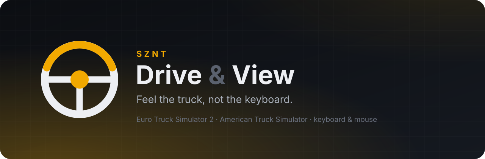
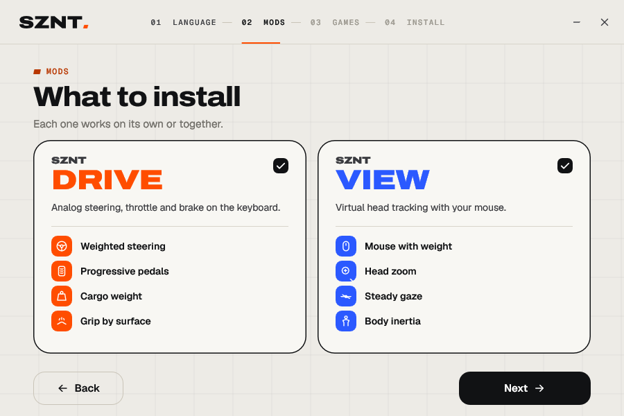
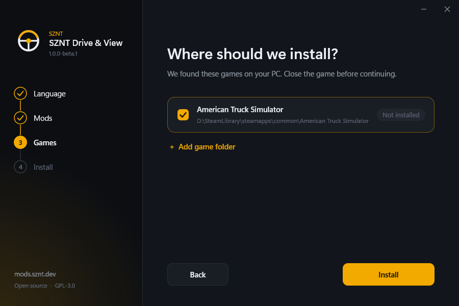
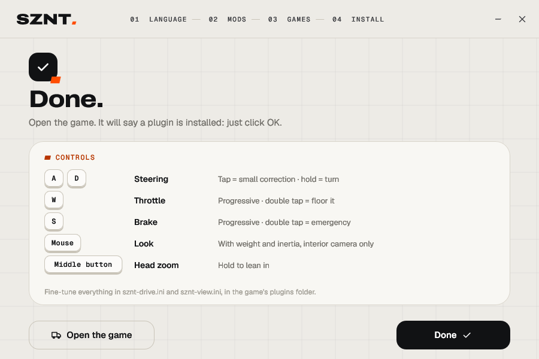
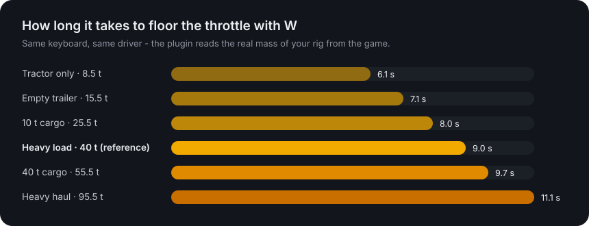
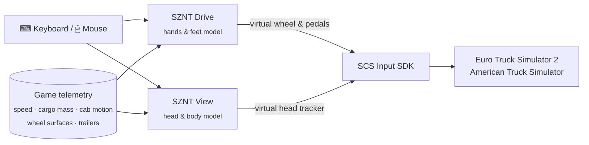

<p align="center">
  
</p>

<p align="center">
  <a href="https://mods.sznt.dev"></a>
  <a href="LICENSE"></a>
</p>
<p align="center">
  
  
  
  
</p>

<p align="center">
  <a href="#-download">Download</a> &nbsp;·&nbsp;
  <a href="#-sznt-drive">SZNT Drive</a> &nbsp;·&nbsp;
  <a href="#-sznt-view">SZNT View</a> &nbsp;·&nbsp;
  <a href="#-controls">Controls</a> &nbsp;·&nbsp;
  <a href="#-how-it-works">How it works</a> &nbsp;·&nbsp;
  <a href="#-is-it-safe">Is it safe?</a> &nbsp;·&nbsp;
  <a href="#-build-it-yourself">Build it yourself</a>
</p>

---

## Why this exists

A keyboard key is either pressed or not. A truck is never like that.

Real drivers don't snap the wheel to full lock, they feed it in. They don't stomp a 40-tonne rig's throttle, they roll into it. And they don't stare through the windshield like a camera bolted to the dashboard: their body leans into turns, their neck keeps the horizon steady, their head sways a little when the road turns to gravel.

We play Euro Truck Simulator 2 on keyboard and mouse, and we wanted *that*. So we built two small plugins that sit between your hands and the game, turn on/off key presses into the movements of a real driver, and leave everything else alone.

<table>
  <tr>
    <td width="50%" valign="top">
      <h3>🛞 SZNT Drive</h3>
      <b>Steering, pedals, weight and grip on the keyboard.</b><br><br>
      W A S D become a weighted steering wheel and two progressive pedals. An empty tractor feels light and eager; a fully loaded rig feels heavy. On ice, snow or wet roads the wheel goes light in your hands.
    </td>
    <td width="50%" valign="top">
      <h3>👀 SZNT View</h3>
      <b>A real driver's head and eyes inside the cab.</b><br><br>
      A virtual head tracker driven by physics: mouse look with weight and inertia, a head that leans in when you hold the middle button, a body that gets pushed around in turns and braking, and a neck that keeps your gaze steady.
    </td>
  </tr>
</table>

The two mods are independent: install one, the other, or both. Euro Truck Simulator 2 is fully tested; American Truck Simulator uses the exact same interface and is in beta.

---

## ⬇ Download

<p>
  <a href="https://mods.sznt.dev/ets2-ats2-drive"></a>
  &nbsp;
  <a href="https://mods.sznt.dev/ets2-ats2-view"></a>
</p>

Both are **free**. Downloads live on [mods.sznt.dev](https://mods.sznt.dev), where you can also grab both mods in a single installer and get an email when a new version is out. This repository holds the complete source code, so you can see exactly what you are installing.

**Installing takes about a minute:** close the game, run the installer, pick your language, the mods and your games, click *Install*. That's it.

<table>
  <tr>
    <td></td>
    <td></td>
  </tr>
  <tr>
    <td></td>
    <td></td>
  </tr>
</table>

The installer:

- finds Euro Truck Simulator 2 and American Truck Simulator in **every Steam library** on your PC (or lets you pick a folder);
- copies the plugins into the game's `bin\win_x64\plugins` folder and **sets up the controls of every profile**, with a backup;
- picks free controller slots, so a real wheel or gamepad you already use is never touched;
- **keeps your settings** when you update, and adds new options with their defaults;
- shows up in *Windows Settings → Apps*, where you can uninstall it. Uninstalling puts your controls back exactly as they were;
- speaks English, Português, Español and Deutsch.

> When the game starts it shows a notice about **"advanced SDK features"**. That's the game's standard warning for any plugin. Click OK.

---

## 🛞 SZNT Drive

<details open>
<summary><b>Steering that has weight</b></summary>

- A short tap makes a tiny correction; holding the key, your hand speeds up smoothly, like turning a real wheel hand over hand.
- How far and how fast you can steer depends on your speed: full lock while maneuvering, gentle and limited on the highway, so a long key press at 90 km/h will never throw the truck into the ditch.
- Release the key and the wheel finishes its movement, then **returns to center on its own**, faster at speed and not at all when parked, just like a real truck's caster.
- Pressing the opposite key counter-steers quickly, the way you'd catch a slide.
</details>

<details open>
<summary><b>Pedals instead of switches</b></summary>

- Holding <kbd>W</kbd> rolls into the throttle gradually, with a delicate start (for pulling away with a heavy trailer) and a soft finish (no jolt at the end).
- Lifting off to change gears? Your foot **remembers** where it was and goes back there quickly.
- <kbd>W</kbd> <kbd>W</kbd> *(tap, then hold)*: floor it, for hills and overtaking.
- <kbd>S</kbd> brakes progressively: a short tap barely touches the pads, holding builds up pressure.
- <kbd>S</kbd> <kbd>S</kbd> *(tap, then hold)*: emergency braking.
</details>

<details open>
<summary><b>It knows what you're hauling</b></summary>

The plugin adds up the tractor, every coupled trailer and the cargo mass the game reports for your job. The tuning you feel with a heavy load is the reference; everything scales from there.

<p align="center"></p>

| Rig | Throttle to 100% | Steering speed | Brake to 100% |
|---|:---:|:---:|:---:|
| Tractor only (8.5 t) | 6.1 s | +26% | 2.4 s |
| Empty trailer (15.5 t) | 7.1 s | +15% | 2.6 s |
| Heavy load (40 t) | 9.0 s | reference | 3.0 s |
| Heavy haul (95.5 t) | 11.1 s | −12% | 3.4 s |

Couple a trailer while parked and the change is instant; if anything changes while you drive, it blends in over a few seconds.
</details>

<details open>
<summary><b>Grip you can feel</b></summary>

When the front tires lose grip, a real steering wheel goes light and stops pulling itself back to center. SZNT Drive reads the surface under the steered wheels and does the same:

| Surface | Grip | Self-centering |
|---|:---:|:---:|
| Dry asphalt, concrete | 100% | full |
| Wet asphalt (wipers on) | 85% | 91% |
| Gravel | 70% | 82% |
| Snow | 40% | 64% |
| Ice | 20% | 52% |
</details>

---

## 👀 SZNT View

SZNT View works like a TrackIR you don't have to wear. Everything is subtle on purpose: you shouldn't notice it, you should just feel *there*.

| | What it does |
|---|---|
| 🖱️ **Mouse look with weight** | Your head has mass: it accelerates, glides to a stop and has a top speed. Fast flicks in one direction gain a little extra reach. |
| 🔍 **Head zoom** | Hold the middle mouse button and you lean toward whatever you're looking at: a mirror, the dashboard, a junction. |
| 🎯 **Steady gaze** | When the cab pitches under braking or rolls in a turn, your neck gently takes the edge off it, like a seated driver's reflex. Subtle on purpose: you still feel the cab lean. |
| 🧍 **Body inertia** | Your body is pushed back when you accelerate, forward when you brake and outwards in turns, following the cab's own sway, not just the chassis. |
| 🛣️ **Surface changes** | Drop two wheels onto the shoulder or roll from asphalt onto gravel and the cab dips a few millimetres: front axle first, then the rear. No camera shake, ever. |
| 🫁 **Life** | Slow breathing, a natural sway, and a glance into tight turns. |

It only takes over the mouse inside the cab; outside cameras behave as usual.

---

## ⌨ Controls

| Keys | SZNT Drive |
|---|---|
| <kbd>W</kbd> / <kbd>S</kbd> | Throttle / brake, progressive |
| <kbd>A</kbd> / <kbd>D</kbd> | Steer left / right, with weight and self-centering |
| <kbd>W</kbd> <kbd>W</kbd> *(hold)* | Floor it |
| <kbd>S</kbd> <kbd>S</kbd> *(hold)* | Emergency braking |
| <kbd>←</kbd> <kbd>↑</kbd> <kbd>→</kbd> <kbd>↓</kbd> | Still work as the game's normal digital controls |

| Input | SZNT View |
|---|---|
| Mouse | Look around (inside the cab) |
| Middle button *(hold)* | Lean in toward where you're looking |
| <kbd>1</kbd> | Interior camera, mouse goes to the head |
| <kbd>2</kbd> … <kbd>9</kbd> | Outside cameras, mouse goes back to the game |

Every key and every value can be changed in two commented text files inside the game folder, `bin\win_x64\plugins\sznt-drive.ini` and `sznt-view.ini`. Save the file and the game picks up the change within half a second, no restart needed.

---

## 🔧 How it works

The game ships an official plugin interface, the **SCS Telemetry & Input SDK**. Both mods are plain DLLs that use only that interface.



- **SZNT Drive** reads <kbd>W</kbd> <kbd>A</kbd> <kbd>S</kbd> <kbd>D</kbd> only while the game window is in front, runs a small model of a driver's hands and feet every frame, and hands the game three analog values, just like a steering wheel and pedals would.
- **SZNT View** feeds the game's built-in head-tracking channels (the same ones TrackIR uses) with the output of a model of a seated body: springs and dampers for the torso, a critically damped "neck" for gaze stabilization, and the real cab motion reported by the game.
- The game's controls file (`controls.sii`) is told to listen to those virtual devices. The installer does this for you and can undo it byte for byte.

### How we built it

This started as a personal itch: driving with a keyboard felt like flipping switches. The first version was a few dozen lines that made the steering ramp up instead of jumping. Then came the evenings of driving, adjusting a number, driving again. Every default in the `.ini` files was chosen that way, by feel, on real routes, with the trucks you know.

Along the way the models grew more physical. Body inertia became a mass-spring-damper. The neck became a critically damped controller, so it reacts fast without overshooting. Weight scaling uses gentle power curves, so an empty tractor feels quick without becoming twitchy. And some ideas were thrown away: camera shake looked impressive for five minutes and was tiring after an hour, so it's gone.

Before every release, automated tests check the parts that must never change by accident. For example, with a heavy load the steering and pedals must behave *exactly* like the version we tuned (the test allows zero difference), and uninstalling must give back the original `controls.sii` byte for byte.

---

## 🔒 Is it safe?

Short answer: it's a small, open-source program that does one job, and you can check every line.

- **The plugins never connect to the internet.** No telemetry, no analytics, no accounts.
- **The installer** makes exactly one optional request: it asks GitHub for the latest version number, so it can tell you when an update is available. Nothing about you or your PC is sent.
- **Keyboard:** SZNT Drive reads only the four driving keys and SZNT View only the camera keys (<kbd>1</kbd>-<kbd>9</kbd>), and only while the game is the active window. Nothing you type is recorded.
- **Mouse:** SZNT View reads mouse *movement* and the middle button to move your head, and only acts while the game is in front and you're in the cab. It never blocks or changes your mouse for other programs.
- **Files it touches:** its own files in the game's `plugins` folder, the `controls.sii` of your profiles (with a backup next to it), and an uninstall entry under your Windows user. Nothing else, no admin rights needed in most setups.
- **Integrity:** the installer verifies the SHA-256 of every file it carries before installing it. Each release publishes the SHA-256 of every download, and you can check yours in PowerShell:

  ```powershell
  Get-FileHash .\SZNT-Setup-v1.0.0-beta.2.exe -Algorithm SHA256
  ```

Some antivirus engines flag *any* new, unsigned program that reads input; that's a heuristic, not a detection. If you'd rather not trust a binary at all, [build it yourself](#-build-it-yourself): it takes a couple of minutes. See [SECURITY.md](SECURITY.md) for the full details and how to report a problem.

---

## ❓ FAQ

<details>
<summary><b>Does it work with a real steering wheel or a gamepad?</b></summary>
SZNT Drive is made for keyboard players and only reacts to W A S D. Your wheel or gamepad keeps working as before. SZNT View works with any controller.
</details>

<details>
<summary><b>Can it change my field of view?</b></summary>
No. The game's SDK doesn't allow plugins to change the FOV. Set it in the game's camera options.
</details>

<details>
<summary><b>Can I use it in multiplayer (TruckersMP / Convoy)?</b></summary>
Plugins only change your own inputs and camera. Still, check the rules of the server you play on before using any plugin.
</details>

<details>
<summary><b>I use TM Real Walk. Does it play nicely?</b></summary>
Yes. While you're walking around, both plugins step aside, and SZNT View follows the camera Real Walk reports.
</details>

<details>
<summary><b>A profile says it "has no controls yet".</b></summary>
Brand-new profiles don't have a controls file until the game saves one. Open the game with that profile, visit Options → Controls once, quit, and run the installer again.
</details>

<details>
<summary><b>Something feels too strong or too weak.</b></summary>
Open <code>sznt-drive.ini</code> or <code>sznt-view.ini</code> in the game's <code>bin\win_x64\plugins</code> folder. Every line is commented. For example <code>weight_throttle</code> controls how much the load changes the throttle, and <code>surface_feel</code> scales the surface effects (0 turns them off). Save, and the change applies within half a second.
</details>

<details>
<summary><b>How do I uninstall?</b></summary>
Windows Settings → Apps → <i>SZNT Drive</i> / <i>SZNT View</i> → Uninstall. Your controls go back exactly as they were and your settings are kept as <code>.ini.bak</code>, in case you come back.
</details>

---

## 🛠 Build it yourself

You need Windows and [MSYS2](https://www.msys2.org/) (or any mingw-w64 toolchain).

```powershell
# in an MSYS2 MINGW64 shell, once:
pacman -S --needed mingw-w64-x86_64-gcc

# then, in PowerShell, from the repository folder:
$env:SZNT_MINGW = "C:\msys64\mingw64\bin"
powershell -ExecutionPolicy Bypass -File build.ps1
```

`build.ps1` runs the test suite, builds both plugins and the three installers (Drive, View and both), and puts everything in `dist\` with a `SHA256SUMS.txt`.

```
src/
  drive/     SZNT Drive: steering & pedal model (drive_model.h) and the plugin
  view/      SZNT View: head & body model (view_model.h) and the plugin
  setup/     the installer (Direct2D UI), controls.sii patcher, .ini upgrader
  common/    shared helpers, version
tests/       model, patcher and .ini tests (+ real controls.sii fixtures)
sdk/         SCS Software SDK headers (MIT)
docs/        manual installation guide, images
```

Prefer not to use the installer at all? [docs/MANUAL-INSTALL.md](docs/MANUAL-INSTALL.md) explains how to do it by hand.

---

## 📄 License

SZNT Drive & View is free software, released under the [GNU General Public License v3.0](LICENSE). You can use, study, share and modify it; if you distribute a modified version, it must stay open under the same license and keep the credits.

The SCS SDK headers in `sdk/` are © SCS Software under the MIT license (see [THIRD_PARTY.md](THIRD_PARTY.md)). Euro Truck Simulator 2 and American Truck Simulator are trademarks of SCS Software; this project is not affiliated with or endorsed by SCS Software. The SZNT name and logo identify the official releases.

<p align="center"><br><br><sub>Made with patience, many kilometres and a keyboard. · <a href="https://mods.sznt.dev">mods.sznt.dev</a></sub></p>
