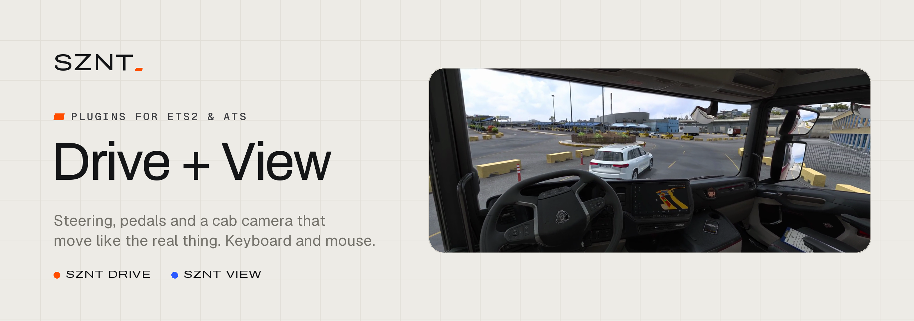
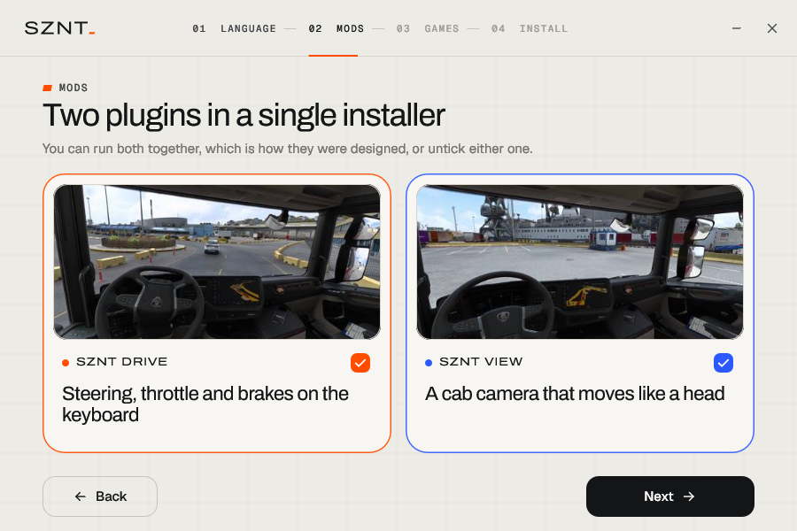
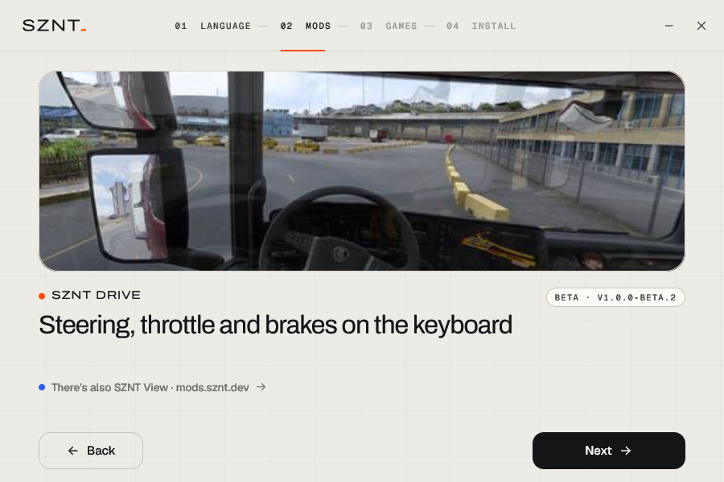
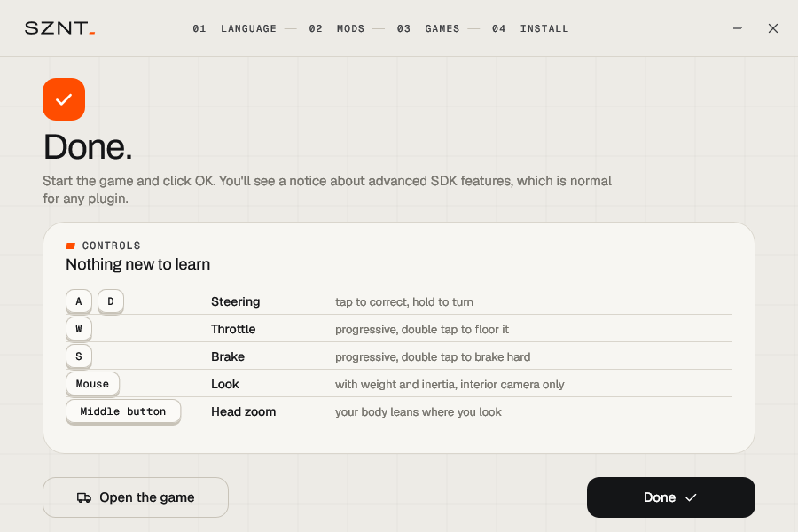
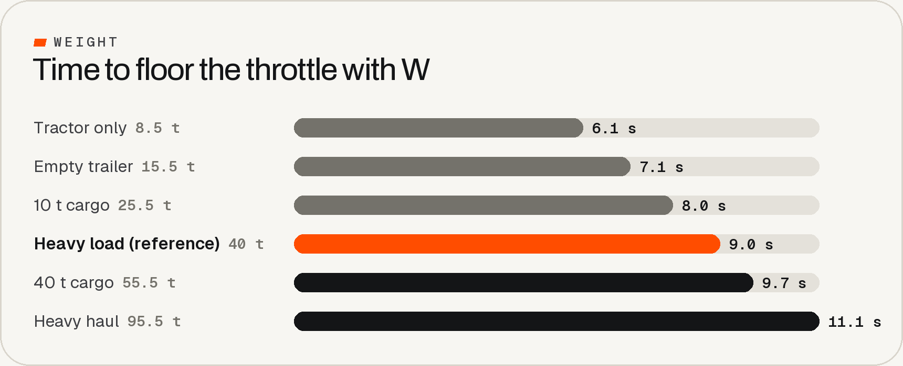
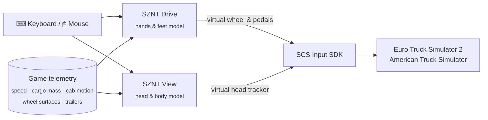

<p align="center">
  <picture><source media="(prefers-color-scheme: dark)" srcset="docs/img/banner-dark.png"></picture>
</p>

<p align="center">
  <a href="https://mods.sznt.dev"></a>
  <a href="LICENSE"></a>
</p>
<p align="center">
  
  
  
  
</p>

<p align="center">
  <a href="#-download">Download</a> &nbsp;·&nbsp;
  <a href="#-sznt-drive">SZNT Drive</a> &nbsp;·&nbsp;
  <a href="#-sznt-view">SZNT View</a> &nbsp;·&nbsp;
  <a href="#-controls">Controls</a> &nbsp;·&nbsp;
  <a href="#-how-it-works">How it works</a> &nbsp;·&nbsp;
  <a href="#-is-it-safe">Is it safe?</a> &nbsp;·&nbsp;
  <a href="#-build-it-yourself">Build it yourself</a> &nbsp;·&nbsp;
  <a href="README.pt-BR.md">Português</a>
</p>

---

## Why I made this

I played ETS2 on a wheel for years. Lately I just haven't felt like setting it up every time I want to drive, so I started playing on keyboard and mouse, and it drove me nuts. You press A and the wheel snaps over at one fixed speed, you let go and it stops dead, and W is either no throttle or all of it. On top of that, the cab camera moves like it's bolted to a tripod.

So I started messing with the game's SDK to fix it for myself, and it turned into two small plugins. One makes W A S D behave like a wheel and pedals, the other makes the mouse move your head like a TrackIR would. Everything else in the game stays the same.

<table>
  <tr>
    <td width="50%" valign="top">
      <h3>🛞 SZNT Drive</h3>
      <b>Steering, throttle and brakes on the keyboard.</b><br><br>
      A quick tap on A or D is a small correction, holding it turns the wheel faster and faster, and when you let go it comes back to center by itself. It also knows how heavy your rig is, so an empty tractor feels light and a 40 t load feels heavy. In the rain or on ice the wheel goes light in your hands.
    </td>
    <td width="50%" valign="top">
      <h3>👀 SZNT View</h3>
      <b>Your head inside the cab, on the mouse.</b><br><br>
      Looking around has some weight to it instead of snapping. Hold the middle button and you lean in toward the mirror or the dash, and your body gets pushed around a bit when you brake, accelerate or take a turn.
    </td>
  </tr>
</table>

You can install one, the other, or both. ETS2 is where I've tested them the most. ATS uses the exact same interface and should work, but I've driven it a lot less, so it's still marked as beta.

---

## ⬇ Download

<p>
  <a href="https://mods.sznt.dev"></a>
</p>

Both are **free**. The easiest way is [mods.sznt.dev](https://mods.sznt.dev): you get one installer with both mods (untick either one if you only want one), and I'll email you when there's a new version. If you'd rather download straight from here, every installer is also on the [latest release](https://github.com/sznt-dev/sznt-drive-view/releases/latest), with its SHA-256. All the source code is in this repo, so you can see exactly what you're installing.

**Installing takes about a minute:** close the game, run the installer, pick your language, the mods and your games, and click *Install*.

<table>
  <tr>
    <td><picture><source media="(prefers-color-scheme: dark)" srcset="docs/img/installer-language-dark.png"></picture></td>
    <td><picture><source media="(prefers-color-scheme: dark)" srcset="docs/img/installer-mods-dark.png"></picture></td>
  </tr>
  <tr>
    <td><picture><source media="(prefers-color-scheme: dark)" srcset="docs/img/installer-drive-dark.png"></picture></td>
    <td><picture><source media="(prefers-color-scheme: dark)" srcset="docs/img/installer-done-dark.png"></picture></td>
  </tr>
</table>

What the installer does for you:

- finds ETS2 and ATS in **every Steam library** on your PC (or lets you pick the folder yourself);
- copies the plugins into the game's `bin\win_x64\plugins` folder and **sets up the controls of every profile**, making a backup first;
- uses free controller slots, so a wheel or gamepad you already have is never touched;
- **keeps your settings** when you update, and adds any new options with their defaults;
- shows up in *Windows Settings → Apps*, and uninstalling puts your controls back exactly how they were;
- speaks English, Português, Español and Deutsch.

> The first time you open the game it shows a message about **"advanced SDK features"**. That shows up for any plugin, just click OK.

---

## 🛞 SZNT Drive

<details open>
<summary><b>A wheel with some weight to it</b></summary>

- A quick tap barely moves the wheel. If you hold the key, your hand speeds up bit by bit, like turning a real wheel hand over hand.
- How far you can turn depends on your speed. Parked you get full lock for maneuvering, on the highway it's gentle and limited, so holding A a bit too long at 90 km/h won't put you in the ditch.
- When you let go, the wheel finishes the movement and **comes back to center on its own**, faster at speed and not at all when you're parked, the way a real truck does.
- Hitting the opposite key counter-steers quickly, like when you catch a slide.
</details>

<details open>
<summary><b>Pedals instead of on/off buttons</b></summary>

- Holding <kbd>W</kbd> brings the throttle in gradually. It starts gentle, which helps a lot pulling away with a heavy trailer, and it doesn't jolt at the end.
- When you lift off to shift, your foot **remembers** where it was and goes back there quickly.
- <kbd>W</kbd> <kbd>W</kbd> *(tap, then hold)*: floor it, for hills and overtaking.
- <kbd>S</kbd> brakes the same way: a short tap barely touches the pads, holding builds up pressure.
- <kbd>S</kbd> <kbd>S</kbd> *(tap, then hold)*: emergency braking.
</details>

<details open>
<summary><b>It knows what you're hauling</b></summary>

The plugin adds up the tractor, every trailer you've got hooked up and the cargo weight the game reports for your job. I tuned everything with a heavy load first, and the rest scales from there.

<p align="center"><picture><source media="(prefers-color-scheme: dark)" srcset="docs/img/weight-dark.png"></picture></p>

| Rig | Throttle to 100% | Steering speed | Brake to 100% |
|---|:---:|:---:|:---:|
| Tractor only (8.5 t) | 6.1 s | +26% | 2.4 s |
| Empty trailer (15.5 t) | 7.1 s | +15% | 2.6 s |
| Heavy load (40 t) | 9.0 s | reference | 3.0 s |
| Heavy haul (95.5 t) | 11.1 s | −12% | 3.4 s |

If you hook up a trailer while parked the change is instant. If something changes while you're driving, it blends in over a few seconds.
</details>

<details open>
<summary><b>You feel the grip</b></summary>

When the front tires lose grip, a real wheel goes light and stops pulling itself back to center. SZNT Drive checks the surface under the front wheels and does the same:

| Surface | Grip | Self-centering |
|---|:---:|:---:|
| Dry asphalt, concrete | 100% | full |
| Wet asphalt (wipers on) | 85% | 91% |
| Gravel | 70% | 82% |
| Snow | 40% | 64% |
| Ice | 20% | 52% |
</details>

---

## 👀 SZNT View

Think of it as a TrackIR you don't have to wear. Everything is subtle on purpose. The idea isn't for you to notice it, it's for the cab to stop feeling like a still picture.

| | What it does |
|---|---|
| 🖱️ **Looking around with weight** | Your head speeds up, glides to a stop and has a top speed, instead of sticking to the cursor. A quick flick gets you a little extra reach. |
| 🔍 **Head zoom** | Hold the middle mouse button and you lean toward whatever you're looking at, like the mirror, the dashboard or a tight junction. |
| 🎯 **Steady gaze** | When the cab dips under braking or leans in a turn, your neck takes a small edge off it, like a seated driver does. You still feel the cab move. |
| 🧍 **Body inertia** | You get pushed back when you accelerate, forward when you brake and outwards in turns, following the cab's own sway. |
| 🛣️ **Surface changes** | Drop two wheels onto the shoulder or roll from asphalt onto gravel and the cab dips a few millimetres, front axle first, then the rear. No camera shake, ever. I tried it and it got tiring after an hour. |
| 🫁 **A bit of life** | Slow breathing, a little natural sway, and a glance into tight turns. |

It only takes over the mouse inside the cab. The outside cameras work like always.

---

## ⌨ Controls

| Keys | SZNT Drive |
|---|---|
| <kbd>W</kbd> / <kbd>S</kbd> | Throttle / brake, progressive |
| <kbd>A</kbd> / <kbd>D</kbd> | Steer left / right, with weight and self-centering |
| <kbd>W</kbd> <kbd>W</kbd> *(hold)* | Floor it |
| <kbd>S</kbd> <kbd>S</kbd> *(hold)* | Emergency braking |
| <kbd>←</kbd> <kbd>↑</kbd> <kbd>→</kbd> <kbd>↓</kbd> | Still work as the game's normal digital controls |

| Input | SZNT View |
|---|---|
| Mouse | Look around (inside the cab) |
| Middle button *(hold)* | Lean in toward where you're looking |
| <kbd>1</kbd> | Interior camera, the mouse moves your head |
| <kbd>2</kbd> … <kbd>9</kbd> | Outside cameras, the mouse goes back to the game |

Every key and every value can be changed in two commented text files in the game folder, `bin\win_x64\plugins\sznt-drive.ini` and `sznt-view.ini`. Save the file and the game picks up the change in about half a second, no restart needed.

---

## 🔧 How it works

The game comes with an official plugin interface, the **SCS Telemetry & Input SDK**. Both mods are plain DLLs that only use that interface.



- **SZNT Drive** reads <kbd>W</kbd> <kbd>A</kbd> <kbd>S</kbd> <kbd>D</kbd> only while the game window is in front, runs a small model of your hands and feet every frame, and sends the game three analog values, the same way a wheel and pedals would.
- **SZNT View** feeds the game's built-in head-tracking channels (the same ones TrackIR uses) with a model of a seated body: springs and dampers for the torso, a "neck" that steadies your gaze without overshooting, and the real cab motion the game reports.
- The game's controls file (`controls.sii`) is told to listen to those virtual devices. The installer does that for you and can undo it byte for byte.

### How I got here

The first version was a few dozen lines that made the steering ramp up instead of jumping. After that it was a lot of evenings driving, changing a number in the .ini and driving again. Every default value was picked that way, by feel, on real routes, with the trucks you know, and since I came from a wheel, that's what I was trying to get close to.

Along the way the models got more physical. The body inertia became a mass on a spring, the neck became a controller that reacts fast without wobbling, and the weight scaling uses gentle curves so an empty tractor feels quick without getting twitchy. Some ideas got thrown out too. Camera shake looked cool for five minutes and was tiring after an hour, so it's gone.

Before every release, automated tests check the parts that should never change by accident. For example, with a heavy load the steering and pedals have to behave *exactly* like the version I tuned (the test allows zero difference), and uninstalling has to give back the original `controls.sii` byte for byte.

---

## 🔒 Is it safe?

Short version: it's a small open source program that does one thing, and you can read every line.

- **The plugins never go online.** No telemetry, no analytics, no account.
- **The installer** makes one optional request: it asks GitHub for the latest version number so it can tell you when there's an update. Nothing about you or your PC is sent.
- **Keyboard:** SZNT Drive only reads the four driving keys and SZNT View only the camera keys (<kbd>1</kbd>-<kbd>9</kbd>), and only while the game is the active window. Nothing you type is recorded.
- **Mouse:** SZNT View reads mouse *movement* and the middle button to move your head, and only while the game is in front and you're in the cab. It never blocks or changes your mouse in other programs.
- **Files it touches:** its own files in the game's `plugins` folder, the `controls.sii` of your profiles (with a backup right next to it), and an uninstall entry under your Windows user. Nothing else, and most setups don't need admin rights.
- **Integrity:** the installer checks the SHA-256 of every file it carries before installing it. Every release lists the SHA-256 of each download, and you can check yours in PowerShell:

  ```powershell
  Get-FileHash .\SZNT-Drive-View-Setup-v1.0.0-beta.2.exe -Algorithm SHA256
  ```

Some antivirus programs flag *any* new unsigned program that reads input. That's a guess on their part, not a detection. If you'd rather not trust a binary at all, [build it yourself](#-build-it-yourself), it only takes a couple of minutes. [SECURITY.md](SECURITY.md) has all the details and how to report a problem.

---

## ❓ FAQ

<details>
<summary><b>The game already has mouse steering. Why use this?</b></summary>
Mouse steering works, but then the mouse can't look around anymore, and I missed that too much. With SZNT the steering goes on W A S D and the mouse is free for your head.
</details>

<details>
<summary><b>Does it work with a real steering wheel or a gamepad?</b></summary>
SZNT Drive is made for the keyboard and only reacts to W A S D, so your wheel or gamepad keeps working like before. SZNT View works with any controller.
</details>

<details>
<summary><b>Can it change my field of view?</b></summary>
No. The SDK doesn't let plugins touch the FOV, so that stays in the game's camera options.
</details>

<details>
<summary><b>Can I use it in multiplayer (TruckersMP / Convoy)?</b></summary>
It only changes your own inputs and camera, nobody else sees anything. Still, check the rules of the server you play on before using any plugin.
</details>

<details>
<summary><b>Linux or Steam Deck?</b></summary>
Windows only for now. I haven't tested it on Proton.
</details>

<details>
<summary><b>I use TM Real Walk. Does it play nicely?</b></summary>
Yes. While you're walking around, both plugins step aside, and SZNT View follows the camera Real Walk reports.
</details>

<details>
<summary><b>A profile says it "has no controls yet".</b></summary>
Brand-new profiles don't have a controls file until the game saves one. Open the game with that profile, go to Options → Controls once, quit, and run the installer again.
</details>

<details>
<summary><b>Something feels too strong or too weak.</b></summary>
Open <code>sznt-drive.ini</code> or <code>sznt-view.ini</code> in the game's <code>bin\win_x64\plugins</code> folder. Every line has a comment. For example <code>weight_throttle</code> sets how much the load changes the throttle, and <code>surface_feel</code> scales the surface effects (0 turns them off). Save, and it applies in about half a second.
</details>

<details>
<summary><b>How do I uninstall?</b></summary>
Windows Settings → Apps → <i>SZNT Drive</i> / <i>SZNT View</i> → Uninstall. Your controls go back exactly how they were, and your settings are kept as <code>.ini.bak</code> in case you come back.
</details>

---

## 🛠 Build it yourself

You need Windows and [MSYS2](https://www.msys2.org/) (or any mingw-w64 toolchain).

```powershell
# in an MSYS2 MINGW64 shell, once:
pacman -S --needed mingw-w64-x86_64-gcc

# then, in PowerShell, from the repository folder:
$env:SZNT_MINGW = "C:\msys64\mingw64\bin"
powershell -ExecutionPolicy Bypass -File build.ps1
```

`build.ps1` runs the tests, builds both plugins and the three installers (Drive, View and both), and puts everything in `dist\` with a `SHA256SUMS.txt`.

```
src/
  drive/     SZNT Drive: steering & pedal model (drive_model.h) and the plugin
  view/      SZNT View: head & body model (view_model.h) and the plugin
  setup/     the installer (Direct2D UI), controls.sii patcher, .ini upgrader
  common/    shared helpers, version
tests/       model, patcher and .ini tests (+ real controls.sii fixtures)
sdk/         SCS Software SDK headers (MIT)
docs/        manual installation guide, images
```

Don't want to use the installer at all? [docs/MANUAL-INSTALL.md](docs/MANUAL-INSTALL.md) shows how to do it by hand.

---

## 📄 License

SZNT Drive & View is free software under the [GNU General Public License v3.0](LICENSE). You can use it, study it, share it and change it. If you share a modified version, it has to stay open under the same license and keep the credits.

The SCS SDK headers in `sdk/` are © SCS Software under the MIT license, and the installer uses the Archivo and Geist fonts under the SIL Open Font License (see [THIRD_PARTY.md](THIRD_PARTY.md)). Euro Truck Simulator 2 and American Truck Simulator are trademarks of SCS Software; this project is not affiliated with or endorsed by SCS Software. The SZNT name and logo identify the official releases.

<p align="center"><br><br><sub><a href="https://mods.sznt.dev">mods.sznt.dev</a></sub></p>
