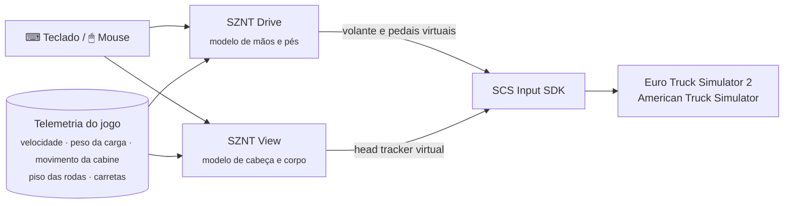

<p align="center">
  <picture><source media="(prefers-color-scheme: dark)" srcset="docs/img/banner-dark.png"></picture>
</p>

<p align="center">
  <a href="https://mods.sznt.dev"></a>
  <a href="LICENSE"></a>
</p>
<p align="center">
  
  
  
  
</p>

<p align="center">
  <a href="#-download">Download</a> &nbsp;·&nbsp;
  <a href="#-sznt-drive">SZNT Drive</a> &nbsp;·&nbsp;
  <a href="#-sznt-view">SZNT View</a> &nbsp;·&nbsp;
  <a href="#-controles">Controles</a> &nbsp;·&nbsp;
  <a href="#-como-funciona">Como funciona</a> &nbsp;·&nbsp;
  <a href="#-é-seguro">É seguro?</a> &nbsp;·&nbsp;
  <a href="#-compilar-você-mesmo">Compilar você mesmo</a> &nbsp;·&nbsp;
  <a href="README.md">English</a>
</p>

---

## Por que eu fiz isso

Joguei ETS2 anos no volante. Ultimamente bateu preguiça de montar ele toda vez que eu queria jogar, então passei pro teclado e mouse, e aquilo me deixava louco. Você aperta o A e o volante vira tudo numa velocidade só, solta e ele para na hora, e o W ou é zero de acelerador ou é tudo. Fora a câmera da cabine, que mexe como se estivesse presa num tripé.

Aí comecei a mexer no SDK do jogo pra resolver isso pra mim, e virou dois plugins pequenos. Um faz o W A S D funcionar como volante e pedais, o outro faz o mouse mexer a sua cabeça como um TrackIR faria. O resto do jogo continua igual.

<table>
  <tr>
    <td width="50%" valign="top">
      <h3>🛞 SZNT Drive</h3>
      <b>Direção, acelerador e freio no teclado.</b><br><br>
      Um toque rápido no A ou no D é uma correção pequena, segurando o volante vai girando cada vez mais rápido, e quando você solta ele volta pro centro sozinho. Ele também sabe o peso do seu conjunto, então o cavalo vazio fica leve e uma carga de 40 t fica pesada. Na chuva ou no gelo o volante fica leve na mão.
    </td>
    <td width="50%" valign="top">
      <h3>👀 SZNT View</h3>
      <b>A sua cabeça dentro da cabine, no mouse.</b><br><br>
      Olhar em volta tem peso, em vez de dar tranco. Segurando o botão do meio você chega mais perto do retrovisor ou do painel, e o seu corpo é jogado um pouco quando você freia, acelera ou faz uma curva.
    </td>
  </tr>
</table>

Dá pra instalar um, o outro ou os dois. O ETS2 é onde eu mais testei. O ATS usa exatamente a mesma interface e deve funcionar, mas rodei bem menos nele, então ainda tá marcado como beta.

---

## ⬇ Download

<p>
  <a href="https://mods.sznt.dev"></a>
</p>

Os dois são **grátis**. O jeito mais fácil é pelo [mods.sznt.dev](https://mods.sznt.dev): você recebe um instalador com os dois mods (dá pra desmarcar um se quiser só o outro), e eu te aviso por e-mail quando sair versão nova. Se preferir baixar direto daqui, todos os instaladores também estão na [última release](https://github.com/sznt-dev/sznt-drive-view/releases/latest), com o SHA-256. Todo o código-fonte tá neste repositório, então dá pra ver exatamente o que você tá instalando.

**A instalação leva coisa de um minuto:** feche o jogo, rode o instalador, escolha o idioma, os mods e os jogos, e clique em *Instalar*.

<table>
  <tr>
    <td><picture><source media="(prefers-color-scheme: dark)" srcset="docs/img/installer-language-dark.png"></picture></td>
    <td><picture><source media="(prefers-color-scheme: dark)" srcset="docs/img/installer-mods-dark.png"></picture></td>
  </tr>
  <tr>
    <td><picture><source media="(prefers-color-scheme: dark)" srcset="docs/img/installer-drive-dark.png"></picture></td>
    <td><picture><source media="(prefers-color-scheme: dark)" srcset="docs/img/installer-done-dark.png"></picture></td>
  </tr>
</table>

O que o instalador faz por você:

- acha o ETS2 e o ATS em **todas as bibliotecas da Steam** do seu PC (ou deixa você escolher a pasta);
- copia os plugins pra pasta `bin\win_x64\plugins` do jogo e **configura os controles de todos os perfis**, fazendo backup antes;
- usa slots de controle livres, então o volante ou o controle que você já usa nunca é mexido;
- **mantém as suas configurações** quando você atualiza, e adiciona as opções novas com o valor padrão;
- aparece em *Configurações do Windows → Aplicativos*, e desinstalar devolve os seus controles exatamente como estavam;
- fala English, Português, Español e Deutsch.

> Na primeira vez que você abre o jogo aparece uma mensagem sobre **"recursos avançados do SDK"**. Ela aparece pra qualquer plugin, é só clicar em OK.

---

## 🛞 SZNT Drive

<details open>
<summary><b>Um volante com peso</b></summary>

- Um toque rápido quase não mexe o volante. Se você segura a tecla, a mão vai ganhando velocidade aos poucos, como quem gira um volante de verdade mão sobre mão.
- O quanto dá pra virar depende da velocidade. Parado você tem o volante todo pra manobrar, na estrada ele fica suave e limitado, então segurar o A um pouco demais a 90 km/h não te joga na vala.
- Quando você solta, o volante termina o movimento e **volta pro centro sozinho**, mais rápido em velocidade e nada quando tá parado, do jeito que um caminhão de verdade faz.
- Apertar a tecla do outro lado contraesterça rápido, como quando você segura uma escorregada.
</details>

<details open>
<summary><b>Pedal em vez de botão liga/desliga</b></summary>

- Segurar o <kbd>W</kbd> vai abrindo o acelerador aos poucos. Começa suave, o que ajuda muito a sair com carreta pesada, e não dá tranco no fim.
- Quando você tira o pé pra trocar de marcha, o pé **lembra** onde estava e volta rápido pra lá.
- <kbd>W</kbd> <kbd>W</kbd> *(toca e segura)*: pé no fundo, pra subida e ultrapassagem.
- O <kbd>S</kbd> freia do mesmo jeito: um toque curto só encosta, segurando a pressão vai subindo.
- <kbd>S</kbd> <kbd>S</kbd> *(toca e segura)*: freada de emergência.
</details>

<details open>
<summary><b>Ele sabe o que você tá puxando</b></summary>

O plugin soma o cavalo, todas as carretas engatadas e o peso da carga que o jogo informa no frete. Eu acertei tudo primeiro com carga pesada, e o resto se ajusta a partir dali.

<p align="center"><picture><source media="(prefers-color-scheme: dark)" srcset="docs/img/weight-dark.png"></picture></p>

| Conjunto | Acelerador até 100% | Velocidade do volante | Freio até 100% |
|---|:---:|:---:|:---:|
| Só o cavalo (8,5 t) | 6,1 s | +26% | 2,4 s |
| Carreta vazia (15,5 t) | 7,1 s | +15% | 2,6 s |
| Carga pesada (40 t) | 9,0 s | referência | 3,0 s |
| Carga especial (95,5 t) | 11,1 s | −12% | 3,4 s |

Se você engata uma carreta parado, a mudança é na hora. Se algo muda com o caminhão andando, ela entra aos poucos em alguns segundos.
</details>

<details open>
<summary><b>Dá pra sentir a aderência</b></summary>

Quando os pneus da frente perdem aderência, o volante de verdade fica leve e para de voltar sozinho pro centro. O SZNT Drive olha o piso embaixo das rodas da frente e faz a mesma coisa:

| Piso | Aderência | Volta ao centro |
|---|:---:|:---:|
| Asfalto seco, concreto | 100% | total |
| Asfalto molhado (limpador ligado) | 85% | 91% |
| Cascalho | 70% | 82% |
| Neve | 40% | 64% |
| Gelo | 20% | 52% |
</details>

---

## 👀 SZNT View

Pensa num TrackIR que você não precisa colocar na cabeça. Tudo é sutil de propósito. A ideia não é você reparar, é a cabine parar de parecer uma foto parada.

| | O que faz |
|---|---|
| 🖱️ **Olhar com peso** | A cabeça acelera, desliza até parar e tem velocidade máxima, em vez de grudar no cursor. Uma mexida rápida dá um alcance a mais. |
| 🔍 **Zoom de cabeça** | Segure o botão do meio do mouse e você se inclina pra onde tá olhando, tipo o retrovisor, o painel ou um cruzamento apertado. |
| 🎯 **Olhar estável** | Quando a cabine abaixa na freada ou inclina na curva, o seu pescoço compensa um pouquinho, como faz quem tá sentado. Você continua sentindo a cabine mexer. |
| 🧍 **Inércia do corpo** | Você é empurrado pra trás quando acelera, pra frente quando freia e pra fora nas curvas, acompanhando o balanço da própria cabine. |
| 🛣️ **Troca de piso** | Joga duas rodas no acostamento ou sai do asfalto pro cascalho e a cabine abaixa uns milímetros, primeiro o eixo da frente, depois o de trás. Sem tremida de câmera, nunca. Eu testei e cansava depois de uma hora. |
| 🫁 **Um pouco de vida** | Respiração lenta, um balanço natural e uma olhada pra dentro das curvas fechadas. |

Ele só assume o mouse dentro da cabine. As câmeras de fora funcionam como sempre.

---

## ⌨ Controles

| Teclas | SZNT Drive |
|---|---|
| <kbd>W</kbd> / <kbd>S</kbd> | Acelerador / freio, progressivos |
| <kbd>A</kbd> / <kbd>D</kbd> | Esquerda / direita, com peso e volta ao centro |
| <kbd>W</kbd> <kbd>W</kbd> *(segura)* | Pé no fundo |
| <kbd>S</kbd> <kbd>S</kbd> *(segura)* | Freada de emergência |
| <kbd>←</kbd> <kbd>↑</kbd> <kbd>→</kbd> <kbd>↓</kbd> | Continuam como os controles digitais normais do jogo |

| Entrada | SZNT View |
|---|---|
| Mouse | Olhar em volta (dentro da cabine) |
| Botão do meio *(segura)* | Inclinar pra onde você tá olhando |
| <kbd>1</kbd> | Câmera interna, o mouse mexe a cabeça |
| <kbd>2</kbd> … <kbd>9</kbd> | Câmeras de fora, o mouse volta pro jogo |

Toda tecla e todo valor podem ser mudados em dois arquivos de texto comentados na pasta do jogo, `bin\win_x64\plugins\sznt-drive.ini` e `sznt-view.ini`. Salvou, o jogo pega a mudança em meio segundo, sem reiniciar.

---

## 🔧 Como funciona

O jogo vem com uma interface oficial pra plugins, o **SCS Telemetry & Input SDK**. Os dois mods são DLLs simples que usam só essa interface.



- O **SZNT Drive** lê o <kbd>W</kbd> <kbd>A</kbd> <kbd>S</kbd> <kbd>D</kbd> só quando a janela do jogo tá na frente, roda um modelinho das suas mãos e pés a cada quadro, e manda pro jogo três valores analógicos, do mesmo jeito que um volante com pedais mandaria.
- O **SZNT View** alimenta os canais de head tracking que o jogo já tem (os mesmos que o TrackIR usa) com um modelo de corpo sentado: molas e amortecedores pro tronco, um "pescoço" que estabiliza o olhar sem ficar balançando, e o movimento real da cabine que o jogo informa.
- O arquivo de controles do jogo (`controls.sii`) é configurado pra escutar esses dispositivos virtuais. O instalador faz isso por você e consegue desfazer byte por byte.

### Como cheguei aqui

A primeira versão eram umas poucas linhas que faziam a direção crescer aos poucos em vez de pular. Depois disso foi muita noite dirigindo, mudando um número no .ini e dirigindo de novo. Todo valor padrão foi escolhido assim, na sensação, em rota de verdade, com os caminhões que você conhece, e como eu vim do volante, era isso que eu tentava alcançar.

No caminho os modelos foram ficando mais físicos. A inércia do corpo virou uma massa numa mola, o pescoço virou um controle que reage rápido sem ficar balançando, e o ajuste por peso usa curvas suaves pra o cavalo vazio ficar ágil sem ficar nervoso. Algumas ideias foram pro lixo também. A tremida de câmera ficou legal por cinco minutos e cansava depois de uma hora, então saiu.

Antes de cada versão, testes automáticos conferem o que nunca pode mudar sem querer. Por exemplo, com carga pesada a direção e os pedais têm que se comportar *exatamente* como a versão que eu ajustei (o teste não aceita diferença nenhuma), e desinstalar tem que devolver o `controls.sii` original byte por byte.

---

## 🔒 É seguro?

Resumindo: é um programa pequeno, de código aberto, que faz uma coisa só, e dá pra ler cada linha.

- **Os plugins nunca acessam a internet.** Sem telemetria, sem analytics, sem conta.
- **O instalador** faz uma consulta opcional: pergunta pro GitHub qual é a última versão, pra te avisar quando tiver atualização. Nada sobre você ou o seu PC é enviado.
- **Teclado:** o SZNT Drive só lê as quatro teclas de direção e o SZNT View só as teclas de câmera (<kbd>1</kbd>-<kbd>9</kbd>), e só quando o jogo é a janela ativa. Nada do que você digita é gravado.
- **Mouse:** o SZNT View lê o *movimento* do mouse e o botão do meio pra mexer a cabeça, e só com o jogo na frente e você na cabine. Ele nunca bloqueia nem muda o mouse em outros programas.
- **Arquivos que ele mexe:** os próprios arquivos na pasta `plugins` do jogo, o `controls.sii` dos seus perfis (com backup do lado) e uma entrada de desinstalação no seu usuário do Windows. Mais nada, e na maioria dos PCs nem precisa de administrador.
- **Integridade:** o instalador confere o SHA-256 de cada arquivo que carrega antes de instalar. Toda versão publica o SHA-256 de cada download, e dá pra conferir o seu no PowerShell:

  ```powershell
  Get-FileHash .\SZNT-Drive-View-Setup-v1.0.0-beta.2.exe -Algorithm SHA256
  ```

Alguns antivírus desconfiam de *qualquer* programa novo sem assinatura que lê o teclado e o mouse. É um chute deles, não uma detecção. Se você prefere não confiar em executável nenhum, [compile você mesmo](#-compilar-você-mesmo), leva uns dois minutos. O [SECURITY.md](SECURITY.md) tem todos os detalhes e como reportar um problema.

---

## ❓ Perguntas frequentes

<details>
<summary><b>O jogo já tem direção no mouse. Por que usar isso?</b></summary>
Direção no mouse funciona, mas aí o mouse não serve mais pra olhar em volta, e eu sentia muita falta disso. Com o SZNT a direção fica no W A S D e o mouse fica livre pra sua cabeça.
</details>

<details>
<summary><b>Funciona com volante de verdade ou controle?</b></summary>
O SZNT Drive é feito pro teclado e só reage ao W A S D, então o seu volante ou controle continua funcionando como antes. O SZNT View funciona com qualquer controle.
</details>

<details>
<summary><b>Dá pra mudar o campo de visão (FOV)?</b></summary>
Não. O SDK não deixa plugin mexer no FOV, então isso continua nas opções de câmera do jogo.
</details>

<details>
<summary><b>Posso usar no multiplayer (TruckersMP / Convoy)?</b></summary>
Ele só muda os seus controles e a sua câmera, ninguém vê nada. Mesmo assim, olha as regras do servidor antes de usar qualquer plugin.
</details>

<details>
<summary><b>Linux ou Steam Deck?</b></summary>
Por enquanto só Windows. Não testei no Proton.
</details>

<details>
<summary><b>Eu uso o TM Real Walk. Dá conflito?</b></summary>
Não. Enquanto você tá andando a pé, os dois plugins saem da frente, e o SZNT View segue a câmera que o Real Walk informa.
</details>

<details>
<summary><b>Um perfil diz que "ainda não tem controles".</b></summary>
Perfil novinho não tem arquivo de controles até o jogo salvar um. Abra o jogo com esse perfil, entre uma vez em Opções → Controles, saia e rode o instalador de novo.
</details>

<details>
<summary><b>Alguma coisa tá forte ou fraca demais.</b></summary>
Abra o <code>sznt-drive.ini</code> ou o <code>sznt-view.ini</code> na pasta <code>bin\win_x64\plugins</code> do jogo. Toda linha tem comentário. Por exemplo, <code>weight_throttle</code> define o quanto a carga muda o acelerador, e <code>surface_feel</code> regula os efeitos de piso (0 desliga). Salvou, vale em meio segundo.
</details>

<details>
<summary><b>Como desinstalo?</b></summary>
Configurações do Windows → Aplicativos → <i>SZNT Drive</i> / <i>SZNT View</i> → Desinstalar. Os seus controles voltam exatamente como estavam, e as suas configurações ficam guardadas como <code>.ini.bak</code>, caso você volte.
</details>

---

## 🛠 Compilar você mesmo

Você precisa de Windows e do [MSYS2](https://www.msys2.org/) (ou qualquer toolchain mingw-w64).

```powershell
# num terminal MSYS2 MINGW64, uma vez:
pacman -S --needed mingw-w64-x86_64-gcc

# depois, no PowerShell, na pasta do repositório:
$env:SZNT_MINGW = "C:\msys64\mingw64\bin"
powershell -ExecutionPolicy Bypass -File build.ps1
```

O `build.ps1` roda os testes, compila os dois plugins e os três instaladores (Drive, View e os dois juntos), e coloca tudo em `dist\` com um `SHA256SUMS.txt`.

```
src/
  drive/     SZNT Drive: modelo de direção e pedais (drive_model.h) e o plugin
  view/      SZNT View: modelo de cabeça e corpo (view_model.h) e o plugin
  setup/     o instalador (interface Direct2D), editor do controls.sii, atualizador dos .ini
  common/    funções compartilhadas, versão
tests/       testes dos modelos, do editor e dos .ini (+ controls.sii reais de exemplo)
sdk/         headers do SDK da SCS Software (MIT)
docs/        guia de instalação manual, imagens
```

Não quer usar o instalador? O [docs/MANUAL-INSTALL.md](docs/MANUAL-INSTALL.md) mostra como fazer na mão.

---

## 📄 Licença

O SZNT Drive & View é software livre, sob a [GNU General Public License v3.0](LICENSE). Você pode usar, estudar, compartilhar e modificar. Se distribuir uma versão modificada, ela tem que continuar aberta sob a mesma licença e manter os créditos.

Os headers do SDK da SCS em `sdk/` são © SCS Software sob licença MIT, e o instalador usa as fontes Archivo e Geist sob a SIL Open Font License (veja o [THIRD_PARTY.md](THIRD_PARTY.md)). Euro Truck Simulator 2 e American Truck Simulator são marcas da SCS Software; este projeto não é afiliado nem endossado pela SCS Software. O nome e o logo SZNT identificam as versões oficiais.

<p align="center"><br><br><sub><a href="https://mods.sznt.dev">mods.sznt.dev</a></sub></p>
